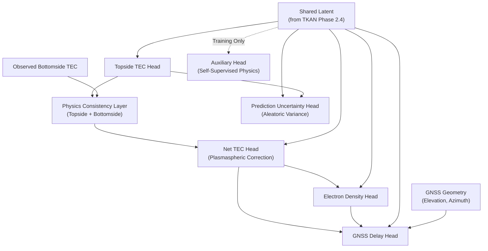

# Phase 2.5: Hierarchical Multi-Task Prediction Network

This phase introduces the final layer of the architecture, binding the temporal processors and physics encoders into a fully resolved **Hybrid Mamba-TKAN Model**.

## Hierarchical Prediction Workflow

Predicting all ionospheric variables independently leads to physical impossibilities (e.g., predicting a low Net TEC but a massively high Topside TEC). To prevent this, Phase 2.5 employs a strict physical hierarchy:

1. **Topside TEC**: The deepest latent representation (from the Memory-Augmented TKAN) predicts the Topside TEC.
2. **Physics Consistency Layer**: Analytically sums `Observed Bottomside TEC + Predicted Topside TEC` to compute the foundational **Base Net TEC**. This enforces the law of conservation.
3. **Net TEC Head**: Applies a slight residual correction to the Base Net TEC to account for unmodeled plasmaspheric tails.
4. **Electron Density Head**: Predicts $NmF2$. This prediction is mathematically conditioned on both the deep latent state AND the newly predicted Net TEC.
5. **GNSS Delay Head**: Predicts slant, vertical, time, and constellation-specific delays. Delays are fundamentally caused by electrons in the path, so this head is mathematically conditioned on the predicted Net TEC, Electron Density, and explicit Geometry parameters (Elevation/Azimuth).

## Tensor Flow Diagram

## Architectural Justification

### 1. Auxiliary Self-Supervised Reconstruction
The `AuxiliaryReconstructionHead` forces the latent state to predict underlying physical parameters (foF2, hmF2, B0, scaleF2) during training. This acts as a powerful regularizer. It ensures the deep latent representations do not become pure "black box" mathematical artifacts, but remain heavily grounded in physical reality.

### 2. Analytical Aleatoric Uncertainty
Traditional deterministic models provide no measure of confidence. The `PredictionUncertaintyHead` maps the deep latent state directly to an estimated Variance ($\sigma^2$), allowing the model to establish tight $95\%$ Confidence Intervals dynamically. This is crucial for real-time space weather forecasting, where knowing *when the model is unsure* (e.g., during unrepresented storms) is just as critical as the prediction itself.
