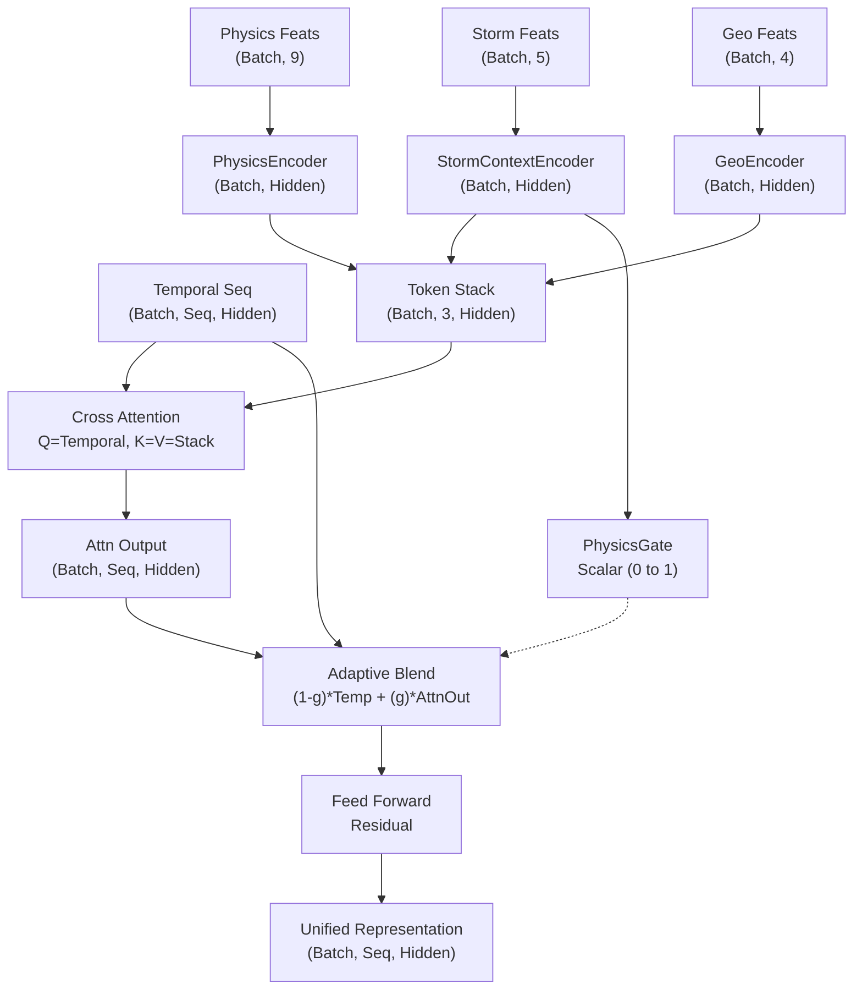
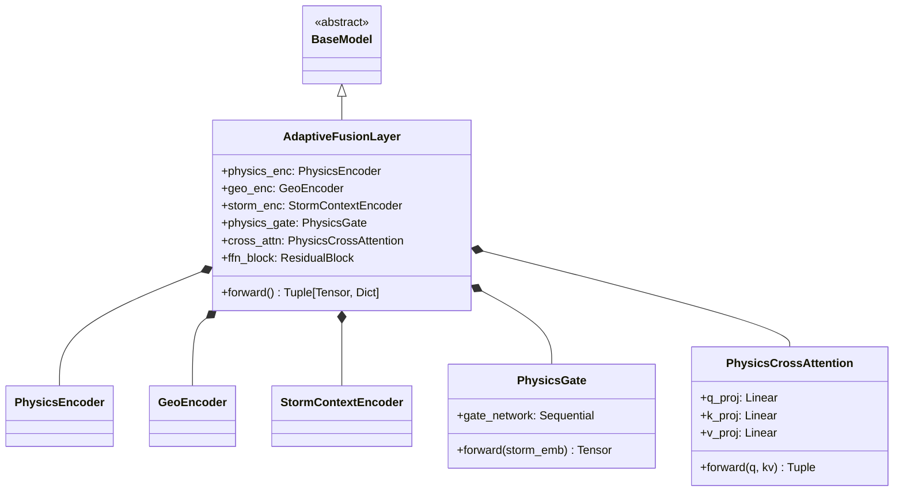

# Phase 2.3: Physics Feature Fusion Network

This module implements the **Adaptive Physics Fusion Layer**. It solves one of the core challenges in space weather forecasting: bridging the gap between historical time-series data and instantaneous physical observations, while remaining robust to geomagnetic storms.

## Architectural Justification

### Why Separate Encoders?
Each input branch represents a completely distinct physical domain:
- **Physics Encoder**: Processes GIRO physical parameters (foF2, hmF2). These are highly correlated non-linear physical state variables, projected through a 2-layer MLP.
- **Geo Encoder**: Processes spatial/temporal metadata (Lat, Lon, LT, DOY). Cyclic variables (Longitude, LT, DOY) cannot be processed as raw floats because $23:59$ is physically adjacent to $00:01$. The `GeoEncoder` uses Sine/Cosine encoding to preserve this continuous circular geometry.
- **Storm Context Encoder**: Processes macroeconomic space weather proxies (Kp, Dst, F10.7). These are low-frequency indices that dictate the *global state* of the ionosphere.

### Physics-Aware Cross Attention
Concatenating physics features onto every temporal time step is highly inefficient and forces the temporal network to continually re-learn static context. 

Instead, we use **Multi-Head Cross Attention**:
1. The **Temporal Sequence** acts as the *Query*.
2. The encoded Physics, Geo, and Storm embeddings are stacked into a 3-token **Context Sequence**, acting as *Keys* and *Values*.
3. At every historical time step, the network "looks up" relevant physics and geographic context using attention.

### Adaptive Physics Gate (The Novelty)
The `PhysicsGate` directly addresses model failure during geomagnetic storms. 
During quiet times, historical temporal data (Mamba branch) is highly predictive. During storms (high Kp, negative Dst), historical data becomes chaotic and untrustworthy.

The `PhysicsGate` reads the Storm Context embedding and outputs a dynamic scalar weight (between 0 and 1).
- **Quiet Time (Low Gate)**: High Temporal Weight, Low Physics Attention Weight.
- **Storm Time (High Gate)**: Low Temporal Weight, High Physics Attention Weight.

## Tensor Flow Diagram

## UML Class Diagram

