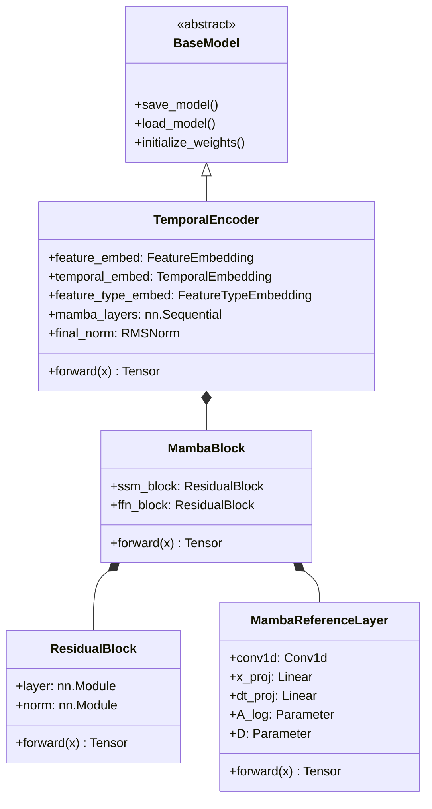

# Phase 2.2: Temporal Branch (Mamba-2 Encoder)

This module implements the **Physics-Aware Temporal Encoder**, the first major block of the multi-branch network. Its primary role is to extract complex non-linear temporal dynamics from historical space weather and ionospheric measurements.

## Why Mamba instead of Transformers?

Standard Transformers rely on self-attention, which scales quadratically $O(N^2)$ with sequence length. This makes them inefficient for very long historical context windows, especially when dealing with high-frequency temporal data (like TEC series). 

**Mamba (Selective State Space Models)** solves this by:
1. Scaling linearly $O(N)$ with sequence length.
2. Maintaining a continuous latent state that selectively remembers or forgets information based on the current input (Data-Dependent Gating).
3. Modeling long-range dependencies efficiently without a fixed-size attention matrix.

Because we are running this inside a physics-informed pipeline that must eventually run on diverse hardware (CPU, MPS, CUDA), we implemented a **Pure PyTorch Reference Mamba-2 Block**. This provides the exact mathematical equivalent of the C++ CUDA kernel but guarantees perfect cross-platform compatibility.

## The Role of Embeddings

### Feature Embedding
Projects the raw 6-dimensional input (TEC, F10.7, Kp, Ap, Dst, SSN) into the network's `embedding_dimension` via Linear mapping, `LayerNorm`, and activation. 

### Temporal Embedding
Because Mamba processes sequences iteratively (unlike Transformers which process them in parallel), it theoretically doesn't need absolute positional embeddings. However, injecting `TemporalEmbedding` helps the state-space model anchor events strictly to their temporal index within the 24-hour sliding window.

### Feature-Type Embedding
Different physical variables operate on fundamentally different scales and physical domains:
- **TEC**: Ionospheric plasma density.
- **Solar (F10.7, SSN)**: Long-term UV/EUV ionizing radiation.
- **Geomagnetic (Kp, Ap, Dst)**: Short-term magnetic field disturbances.

The `FeatureTypeEmbedding` provides the network with a learned physical context bias, explicitly teaching it which category of physics it is currently processing.

## UML Class Diagram

