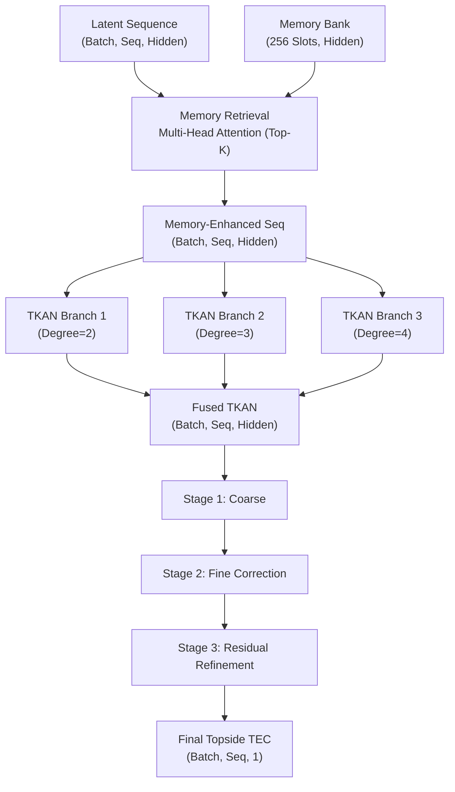
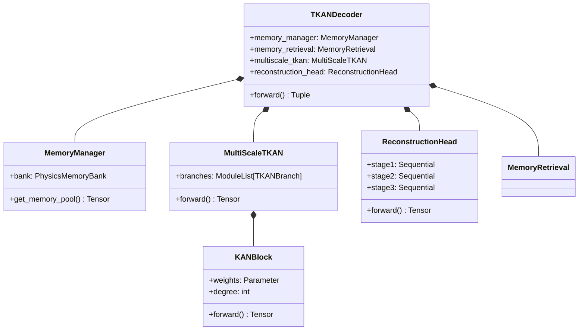

# Phase 2.4: Physics-Guided Memory-Augmented TKAN Decoder

This module implements the Decoder phase of the pipeline. It is responsible for taking the highly complex unified latent representation (generated in Phase 2.3) and reconstructing the actual physical target: Topside TEC.

## Architectural Justification

### Why a Memory Bank?
Space weather events, particularly severe geomagnetic storms, are rare (heavy-tailed distribution). Standard neural networks suffer from "catastrophic forgetting" of these rare events because the gradients from the abundant quiet-time data overwhelm the storm data.

By implementing a **Physics Memory Bank**, we allocate explicit, persistent vector slots for different regimes:
1. **Quiet-Time Memory**: Normal diurnal patterns.
2. **Storm-Time Memory**: Severe geomagnetic disturbances.
3. **Latitude Memory**: Regional physics (Equatorial Anomaly vs Polar regions).
4. **Seasonal Memory**: Winter vs Summer anomalies.
5. **Prototype Memory**: General routing parameters.

The dynamic sequence queries this memory bank using Multi-Head Attention to "recall" how it should reconstruct the TEC under the current conditions.

### Why Multi-Scale TKAN?
Instead of a standard Multi-Layer Perceptron (MLP) or an RNN, we utilize a **Multi-Scale Temporal Kolmogorov-Arnold Network (TKAN)**.
- **Pure PyTorch KAN**: We implemented a differentiable KAN layer using Chebyshev polynomial bases. KANs place activation functions on the *edges* (weights) rather than nodes, allowing them to model highly complex, non-linear physical functions with fewer parameters.
- **Multi-Scale Branches**: The network processes the data through 3 parallel TKAN branches operating at different polynomial degrees (Scale 1: $degree=2$, Scale 2: $degree=3$, Scale 3: $degree=4$). This captures both simple linear trends and highly complex non-linear oscillations simultaneously.

### Coarse-to-Fine Reconstruction
Physical variables like TEC cannot just be estimated blindly. We use a 3-stage reconstruction head:
1. **Coarse Estimate**: Base prediction.
2. **Fine Correction**: Models the delta (residual offset) against the coarse estimate.
3. **Residual Refinement**: High-frequency refinement.

## Tensor Flow Diagram

## UML Class Diagram

