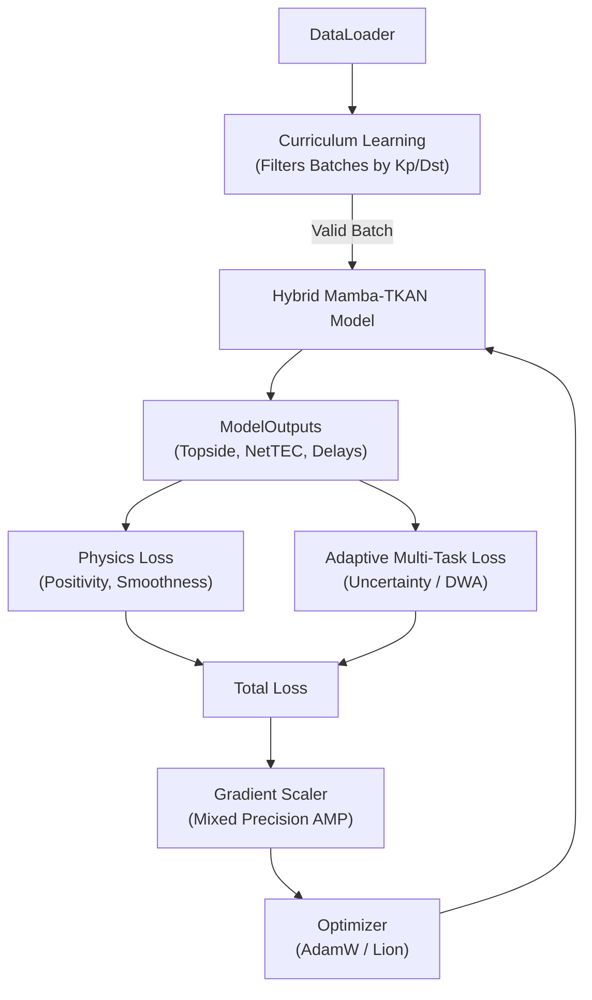
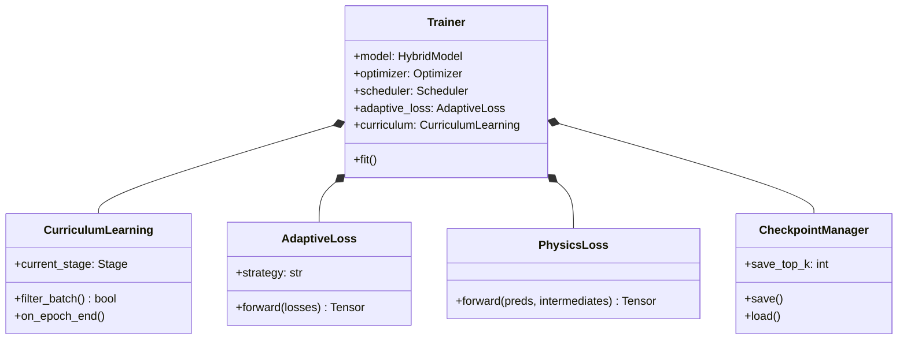

# Phase 3: Research-Grade Training Framework

This module contains the complete training engine designed specifically for the physics-guided multi-task architecture built in Phase 2.

## Core Mechanisms

### 1. Adaptive Multi-Task Optimization
Because the network predicts multiple highly divergent variables (Topside TEC, Net TEC, Electron Density, and GNSS Delays), the loss magnitudes differ wildly. Hardcoding $\lambda$ weights is inefficient.
The framework natively supports:
- **Uncertainty Weighting:** Learns the inherent noise variance ($\sigma^2$) of each task and weights cleaner tasks higher.
- **Dynamic Weight Averaging (DWA):** Balances tasks based on their relative rate of convergence over previous epochs.
- **GradNorm:** Balances tasks by forcing the gradient magnitudes flowing into the final shared `TKANDecoder` layer to be nearly equal.

### 2. Physics-Guided Loss Formulation
Deep learning models can easily learn shortcuts that violate physics. The `PhysicsLoss` module applies soft gradient penalties instead of hard clamping:
- **$Topside \ge 0$ & $Density \ge 0$:** A mirrored ReLU penalty applying a gradient only when the model predicts impossible negative values.
- **Net TEC Consistency:** Penalizes the predicted Net TEC if it deviates massively from the analytical sum of $Bottomside + Predicted Topside$.
- **Temporal Smoothness:** Applies a first-derivative penalty preventing jittering/high-frequency noise in consecutive temporal predictions.

### 3. Curriculum Learning
Geomagnetic storms are rare, chaotic, heavy-tailed events. If trained naively, the model suffers "catastrophic forgetting" of storms because the quiet-time data overwhelms the gradients.
The `CurriculumLearning` module enforces a state machine:
- **Stage 1 (Quiet):** Network learns basic diurnal structures ($Kp \le 2$).
- **Stage 2 (Moderate):** Introduces slight variations.
- **Stage 3 (Storm):** Forces the model to use the Physics Gate and Storm Memory Banks to handle massive disruptions ($Kp \ge 6$).

## Training Flow Diagram

## Class Diagram

